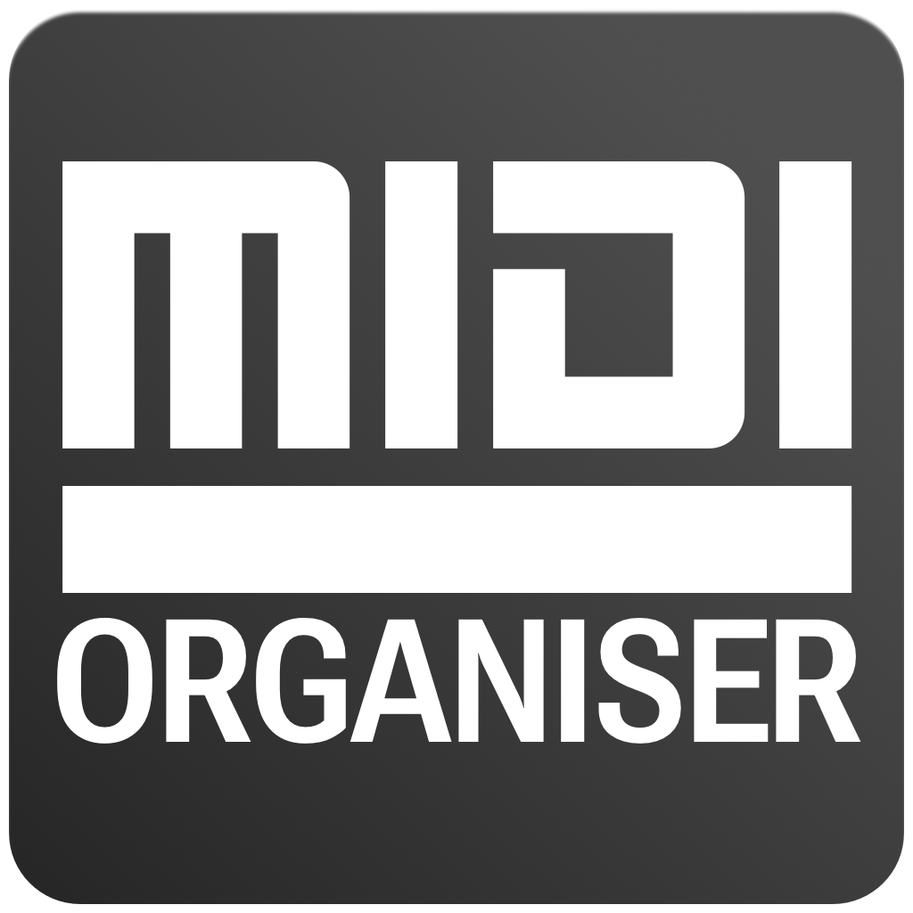

# doerdMIDI.github.io
doerd MIDI tools collection

## MIDIorganizer

organise your midi devices and keep overview about midi output and data.
each device and every controller can be listed with their midi data.

## MIDItranslator

translate raw midi input hex to common midi commands.

